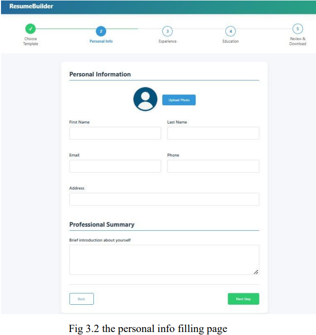
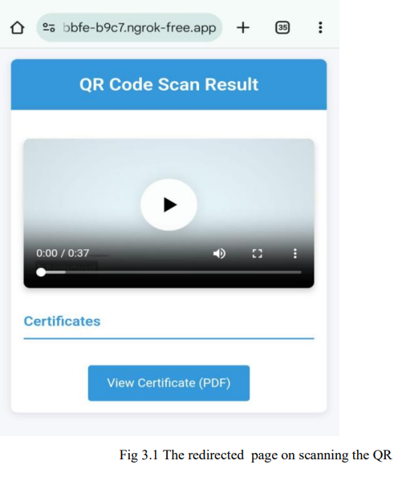
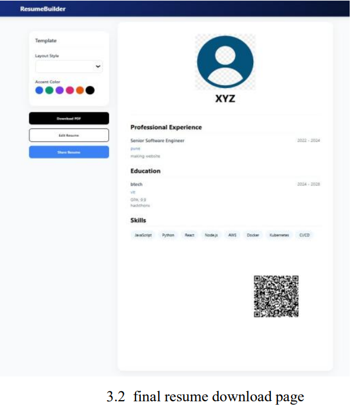

# 🚀 QR Resume Builder — Interactive Resumes with Video & Certificate Integration

> 📄 A modern resume builder that enables users to create professional, interactive resumes embedded with **QR codes** linking to **video introductions**, **certifications**, and **portfolios**.

---

## 🧠 About the Project

Traditional resumes fall short in showcasing a candidate's personality, creativity, and real-world skills. **QR Resume Builder** bridges this gap by allowing users to:

- Build sleek, well-formatted resumes effortlessly
- Embed **QR codes** linking to dynamic content
- Improve hiring engagement with video intros & verified certifications

🎯 Designed for job seekers looking to stand out in the **modern, digital-first hiring environment**.

---

## 🌟 Key Features

- ✅ Clean and interactive UI for building resumes
- 🔄 Real-time preview & edit
- 🔐 User authentication and secure data handling
- 📥 Downloadable resume with embedded QR codes
- 🎥 Support for video intros and hosted certificates
- 🌐 Mobile-friendly QR scan pages via **NGROK** tunnel
- 📱 Cross-device QR compatibility (Android/iOS/Desktop)

---

## 🛠️ Tech Stack

| Frontend     | Backend   | Database | Other Tools |
|--------------|-----------|----------|-------------|
| HTML, CSS, JS | Node.js   | MySQL    | NGROK, QR.js, QR Code Generator API |

---

## 📸 Screenshots

| Resume Builder UI | QR Redirect Page | Resume Download |
|-------------------|------------------|------------------|
|  |  |  |

---

## 🧪 Testing

- ✅ Unit Testing – validation, database operations, QR code generation
- 🔄 Integration Testing – frontend ↔ backend ↔ database
- 👥 User Testing – UI/UX feedback from real users
- 📱 Cross-Platform – QR scanned and tested on Android, iOS, Windows

---

## ⚙️ How it Works

1. User signs in and fills resume data
2. Video and certificate URLs are linked to fields
3. System generates QR code using dynamic API
4. Resume is formatted into a template
5. Final resume includes scannable QR, downloadable as PDF

> Recruiters scan the QR to view a hosted, responsive web page showing video/certificates

---

## 🔐 Security Measures

- ✅ Custom NGROK subdomain to avoid phishing
- 🔁 One-time-access URLs for QR content
- 🔒 Plan to migrate to HTTPS-secured custom domain in future

---

## 🚧 Future Enhancements

- 🧠 AI-based resume analysis and improvements
- 📊 Recruiter dashboard for resume management
- 🌍 Multi-language support
- 📂 More resume templates and styles
- 📱 Dedicated mobile app for building resumes

---

## 👨‍💻 Authors

Developed by students at **VIT Pune**:

- Prof. Lokesh Khedekar  
- Priyanka Kalawadiya  
- Chaitanya Kakde  
- Atharva Kalaskar  
- Jayaprakash Konduru  
- Soham Kadu  

---

## 📄 License

This project is licensed under the **MIT License** – you're free to use, modify, and distribute it.

---

## ⭐️ Show Your Support

If you found this useful:

- ⭐️ Star the repo
- 🍴 Fork it
- 📣 Share with your peers
- 💬 Submit issues or PRs to improve it

---

> 💡 _“Let your resume do more than talk. Let it engage.”_
